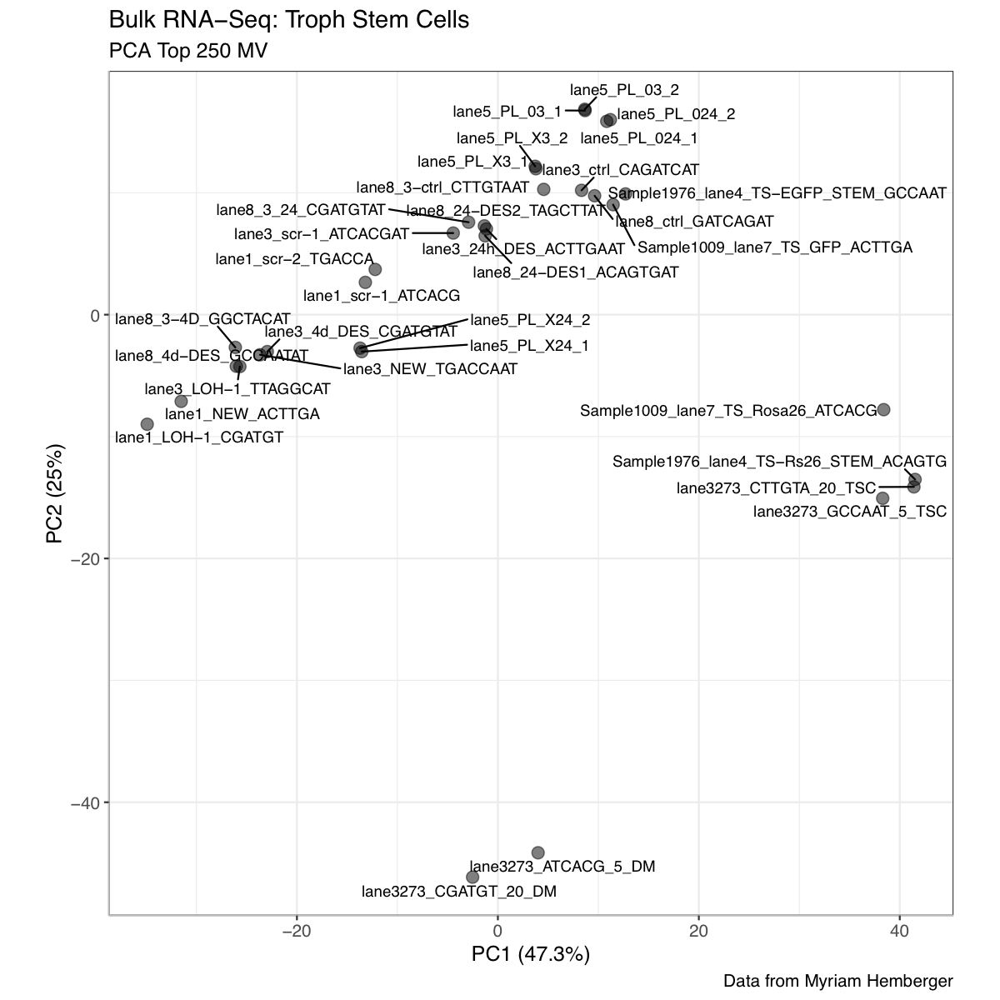
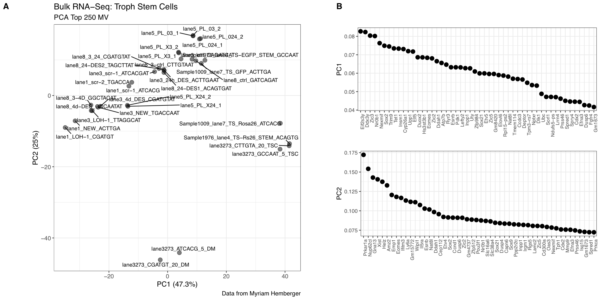

# TSC Custom Transcriptome

**Russell S. Hamilton<sup>a</sup>,  D. Stephen Charnock-Jones<sup>b</sup>,  Myriam Hemberger<sup>c</sup>**


<sup>a</sup> Department of Genetics, University of Cambridge, Downing Street, Cambridge, CB2 3EH
<sup>b</sup> Department of Obstetrics and Gynaecology, University of Cambridge, The Rosie Hospital, Cambridge, CB2 0SW, UK
<sup>c</sup> Cumming School of Medicine, University of Calgary, Calgary, AB T2N 4N1
<sup>d</sup> Centre for Trophoblast Research, Department of Physiology, Development and Neuroscience, University of Cambridge, Downing Street, Cambridge, CB2 3EG, UK


## Sample List

| FASTQ     |  Cell line / treatment | Notes | sc use? |
| --------- | ---------------------- | ----- | ------- |
| lane1_LOH-1_CGATGT_L001_R1.fastq.gz      | TS-EGFP Esrrb KD (?)           | LOH-1 / PL_CE |   |
| lane1_NEW_ACTTGA_L001_R1.fastq.gz        | TS-EGFP Esrrb KD (?)           | NEW   / PL_CE |   |
| lane1_scr-1_ATCACG_L001_R1.fastq.gz      | TS-EGFP contr for Esrrb KD (?) | scr-1 / PL_CE |   |
| lane1_scr-2_TGACCA_L001_R1.fastq.gz      | TS-EGFP contr for Esrrb KD (?) | scr-2 / PL_CE |   |
| lane3_24h_DES_ACTTGAAT_L003_R1.fastq.gz  | TS-EGFP                        | 24h DES       |   |
| lane3_4d_DES_CGATGTAT_L003_R1.fastq.gz   | TS-EGFP                        | 4d DES        |   |
| lane3_ctrl_CAGATCAT_L003_R1.fastq.gz     | TS-EGFP                        | ctrl          | * |
| lane3_LOH-1_TTAGGCAT_L003_R1.fastq.gz    | TS-EGFP Esrrb KD               | LOH-1         |   |
| lane3_NEW_TGACCAAT_L003_R1.fastq.gz      | TS-EGFP Esrrb KD               | NEW           |   |
| lane3_scr-1_ATCACGAT_L003_R1.fastq.gz    | TS-EGFP ctrl to Esrrb KD       | scr-1         |   |
| lane3273_ATCACG_5_DM_L003_R1.fastq.gz    | TS-Rs26                        | 5% DM         |   |
| lane3273_CGATGT_20_DM_L003_R1.fastq.gz   | TS-Rs26                        | 20% DM        |   |
| lane3273_CTTGTA_20_TSC_L003_R1.fastq.gz  | TS-Rs26                        | 20% TSC       | * |
| lane3273_GCCAAT_5_TSC_L003_R1.fastq.gz   | TS-Rs26                        | 5% TSC        |   |
| lane3273_GTATGC__L003_R1.fastq.gz        | ???                            | ???           |   |
| lane5_PL_024_1_L005_R1.fastq.gz          | TS-EGFP MEKi 24h               |               |   |
| lane5_PL_024_2_L005_R1.fastq.gz          | TS-EGFP MEKi 24h               |               |   |
| lane5_PL_03_1_L005_R1.fastq.gz           | TS-EGFP MEKi 3h                |               |   |
| lane5_PL_03_2_L005_R1.fastq.gz           | TS-EGFP MEKi 3h                |               |   |
| lane5_PL_X24_1_L005_R1.fastq.gz          | TS-EGFP controls (MEKi 24h)    |               | * |
| lane5_PL_X24_2_L005_R1.fastq.gz          | TS-EGFP controls (MEKi 24h)    |               | * |
| lane5_PL_X3_1_L005_R1.fastq.gz           | TS-EGFP controls (MEKi 3h)     |               | * |
| lane5_PL_X3_2_L005_R1.fastq.gz           | TS-EGFP controls (MEKi 3)      |               | * |
| lane8_24-DES1_ACAGTGAT_L008_R1.fastq.gz  | TS-EGFP DES                    | 24-DES1       |   |
| lane8_24-DES2_TAGCTTAT_L008_R1.fastq.gz  | TS-EGFP DES                    | 24-DES2       |   |
| lane8_3_24_CGATGTAT_L008_R1.fastq.gz     | TS-EGFP                        | 3_24          |   |
| lane8_3-4D_GGCTACAT_L008_R1.fastq.gz     | TS-EGFP                        | 3-4D          |   |
| lane8_3-ctrl_CTTGTAAT_L008_R1.fastq.gz   | TS-EGFP                        | 3-ctrl        |   |
| lane8_4d-DES_GCCAATAT_L008_R1.fastq.gz   | TS-EGFP DES                    | 4d-DES        |   |
| lane8_ctrl_GATCAGAT_L008_R1.fastq.gz     | TS-EGFP                        | cntl          |   |
| Sample1009_lane7_TS_GFP_ACTTGA_L007_R1.fastq.gz       | TS-EGFP | ScriptSeq ES TS E7.5emb e7.5mid e8.5troph | * |
| Sample1009_lane7_TS_Rosa26_ATCACG_L007_R1.fastq.gz    | TS-Rs26 | ScriptSeq ES TS E7.5emb e7.5mid e8.5troph | * |
| Sample1976_lane4_TS-EGFP_STEM_GCCAAT_L004_R1.fastq.gz | (5) TS-EGFP STEM | Plet1 knockdown and 1d diff. TSCs | * |
| Sample1976_lane4_TS-Rs26_STEM_ACAGTG_L004_R1.fastq.gz | (1) TS-Rs26 STEM | Plet1 knockdown and 1d diff. TSCs | * |


## Custom Transcriptome Protocol

Instructions below use the protocol from the original hisat2/stringtie paper:

Pertea, M., Kim, D., Pertea, G.M., Leek, J.T. & Salzberg, S.L. (2016) Transcript-level Expression Analysis of RNA-seq Experiments With HISAT, StringTie and Ballgown. Nature Protocols, 11:9, 1650-1667 [[DOI](https://doi.org/10.1038/nprot.2016.095)] [[Pubmed](https://pubmed.ncbi.nlm.nih.gov/27560171/)]


## Reference Genome Preparation

First set up some variables to be used by the processing steps outlines below

````
REFDIR="/storage/Genomes/Mus_musculus/GRCm38"
REFGTF="Mus_musculus.GRCm38.84.gtf"
REFFAS="Mus_musculus.GRCm38.dna.chromosome.all.fa"
REFNAM="GRCm38"
CORES=12
````


### Build a hisat2 genome index for GRCm38 (with splice sites)

This step is very mamory intensive

````
module load hisat2
cd ${REFDIR}

hisat2_extract_splice_sites.py ${REFGTF} > ${REFGTF/gtf/hisat2.ss}
hisat2_extract_exons.py        ${REFGTF} > ${REFGTF/gtf/hisat2.exons}

hisat2-build -a -p ${CORES} \
             --ss ${REFGTF/gtf/hisat2.ss} \
             --exon ${REFGTF/gtf/hisat2.exons} \
             ${REFFAS} \
             ${REFNAM}
````

## FASTQ Preprocessing

Run the FQ files through some quality control tools using [clusterflow](http://clusterflow.io) pipelines

````
  module load fastqc fastq_screen trim_galore

  cf fastqc       Sample2406*.fastq.gz

  cf fastq_screen Sample2406*.fastq.gz

  cf trim_galore  Sample2406*.fastq.gz
````

## Run Alignments

Use hisat2 to align each sample file to the newly created reference genome index for hisat2. In the same loop also sort the alignment BAM files and create sample specific GTF files using stringtie.

````
module load hisat2 samtools stringtie

for i in *_trimmed.fq.gz;
do

  echo "hisat2:" ${i}
  hisat2 -p ${CORES} --dta -x ${REFDIR}/${REFNAM} -U ${i} -S ${i/.fq.gz/.sam} &>  ${i/.fq.gz/.hisat2.log}

  echo "samtools:" ${i}
  samtools sort -@ ${CORES} -o ${i/.fq.gz/.bam} ${i/.fq.gz/.sam}
  rm ${i/.fq.gz/.sam}

  echo "stringtie:" ${i}
  stringtie ${i/.fq.gz/.bam} -l ${i/_[AGCT]*_L00[0-9]_R1.fastq.gz/} -p ${CORES} -G ${REFDIR}/${REFGTF} -o ${i/.fq.gz/.gt
f}

done
````

## Run featureCounts to get gene counts

````
cf featureCounts *_trimmed.bam
````


| Sample | Alignment (Unique) | Alignment (Overall) | FeatureCounts | GTF |
| ------ | ------------------ | ------------------- | ------------- | --- |
| lane1_LOH-1_CGATGT_L001_R1 | 88.17% | 97.30% | [[FeatureCounts](FeatureCounts/lane1_LOH-1_CGATGT_L001_R1_trimmed.bam_featureCounts_counts.txt)] | [[GTF](GTF/lane1_LOH-1_CGATGT_L001_R1_trimmed.gtf.gz)] |
| lane1_NEW_ACTTGA_L001_R1 | 87.09% | 97.16% | [[FeatureCounts](FeatureCounts/lane1_NEW_ACTTGA_L001_R1_trimmed.bam_featureCounts_counts.txt)] | [[GTF](GTF/lane1_NEW_ACTTGA_L001_R1_trimmed.gtf.gz)] |
| lane1_scr-1_ATCACG_L001_R1 | 86.86% | 96.71% | [[FeatureCounts](FeatureCounts/lane1_scr-1_ATCACG_L001_R1_trimmed.bam_featureCounts_counts.txt)] | [[GTF](GTF/lane1_scr-1_ATCACG_L001_R1_trimmed.gtf.gz)] |
| lane1_scr-2_TGACCA_L001_R1 | 85.96% | 96.45% | [[FeatureCounts](FeatureCounts/lane1_scr-2_TGACCA_L001_R1_trimmed.bam_featureCounts_counts.txt)] | [[GTF](GTF/lane1_scr-2_TGACCA_L001_R1_trimmed.gtf.gz)] |
| lane3273_ATCACG_5_DM_L003_R1 | 89.57% | 97.26% | [[FeatureCounts](FeatureCounts/lane3273_ATCACG_5_DM_L003_R1_trimmed.bam_featureCounts_counts.txt)] | [[GTF](GTF/lane3273_ATCACG_5_DM_L003_R1_trimmed.gtf.gz)] |
| lane3273_CGATGT_20_DM_L003_R1 | 88.24% | 97.76% | [[FeatureCounts](FeatureCounts/lane3273_CGATGT_20_DM_L003_R1_trimmed.bam_featureCounts_counts.txt)] | [[GTF](GTF/lane3273_CGATGT_20_DM_L003_R1_trimmed.gtf.gz)] |
| lane3273_CTTGTA_20_TSC_L003_R1 | 86.62% | 97.04% | [[FeatureCounts](FeatureCounts/lane3273_CTTGTA_20_TSC_L003_R1_trimmed.bam_featureCounts_counts.txt)] | [[GTF](GTF/lane3273_CTTGTA_20_TSC_L003_R1_trimmed.gtf.gz)] |
| lane3273_GCCAAT_5_TSC_L003_R1 | 88.88% | 97.46% | [[FeatureCounts](FeatureCounts/lane3273_GCCAAT_5_TSC_L003_R1_trimmed.bam_featureCounts_counts.txt)] | [[GTF](GTF/lane3273_GCCAAT_5_TSC_L003_R1_trimmed.gtf.gz)] |
| lane3_24h_DES_ACTTGAAT_L003_R1 | 87.85% | 97.08% | [[FeatureCounts](FeatureCounts/lane3_24h_DES_ACTTGAAT_L003_R1_trimmed.bam_featureCounts_counts.txt)] | [[GTF](GTF/lane3_24h_DES_ACTTGAAT_L003_R1_trimmed.gtf.gz)] |
| lane3_4d_DES_CGATGTAT_L003_R1 | 88.75% | 97.29% | [[FeatureCounts](FeatureCounts/lane3_4d_DES_CGATGTAT_L003_R1_trimmed.bam_featureCounts_counts.txt)] | [[GTF](GTF/lane3_4d_DES_CGATGTAT_L003_R1_trimmed.gtf.gz)] |
| lane3_ctrl_CAGATCAT_L003_R1 | 87.64% | 97.07% | [[FeatureCounts](FeatureCounts/lane3_ctrl_CAGATCAT_L003_R1_trimmed.bam_featureCounts_counts.txt)] | [[GTF](GTF/lane3_ctrl_CAGATCAT_L003_R1_trimmed.gtf.gz)] |
| lane3_LOH-1_TTAGGCAT_L003_R1 | 88.64% | 97.28% | [[FeatureCounts](FeatureCounts/lane3_LOH-1_TTAGGCAT_L003_R1_trimmed.bam_featureCounts_counts.txt)] | [[GTF](GTF/lane3_LOH-1_TTAGGCAT_L003_R1_trimmed.gtf.gz)] |
| lane3_NEW_TGACCAAT_L003_R1 | 88.44% | 97.29% | [[FeatureCounts](FeatureCounts/lane3_NEW_TGACCAAT_L003_R1_trimmed.bam_featureCounts_counts.txt)] | [[GTF](GTF/lane3_NEW_TGACCAAT_L003_R1_trimmed.gtf.gz)] |
| lane3_scr-1_ATCACGAT_L003_R1 | 87.74% | 96.80% | [[FeatureCounts](FeatureCounts/lane3_scr-1_ATCACGAT_L003_R1_trimmed.bam_featureCounts_counts.txt)] | [[GTF](GTF/lane3_scr-1_ATCACGAT_L003_R1_trimmed.gtf.gz)] |
| lane5_PL_024_1_L005_R1 | 78.59% | 92.26% | [[FeatureCounts](FeatureCounts/lane5_PL_024_1_L005_R1_trimmed.bam_featureCounts_counts.txt)] | [[GTF](GTF/lane5_PL_024_1_L005_R1_trimmed.gtf.gz)] |
| lane5_PL_024_2_L005_R1 | 78.63% | 92.30% | [[FeatureCounts](FeatureCounts/lane5_PL_024_2_L005_R1_trimmed.bam_featureCounts_counts.txt)] | [[GTF](GTF/lane5_PL_024_2_L005_R1_trimmed.gtf.gz)] |
| lane5_PL_03_1_L005_R1 | 79.27% | 92.04% | [[FeatureCounts](FeatureCounts/lane5_PL_03_1_L005_R1_trimmed.bam_featureCounts_counts.txt)] | [[GTF](GTF/lane5_PL_03_1_L005_R1_trimmed.gtf.gz)] |
| lane5_PL_03_2_L005_R1 | 79.30% | 92.07% | [[FeatureCounts](FeatureCounts/lane5_PL_03_2_L005_R1_trimmed.bam_featureCounts_counts.txt)] | [[GTF](GTF/lane5_PL_03_2_L005_R1_trimmed.gtf.gz)] |
| lane5_PL_X24_1_L005_R1 | 83.00% | 95.04% | [[FeatureCounts](FeatureCounts/lane5_PL_X24_1_L005_R1_trimmed.bam_featureCounts_counts.txt)] | [[GTF](GTF/lane5_PL_X24_1_L005_R1_trimmed.gtf.gz)] |
| lane5_PL_X24_2_L005_R1 | 83.00% | 95.06% | [[FeatureCounts](FeatureCounts/lane5_PL_X24_2_L005_R1_trimmed.bam_featureCounts_counts.txt)] | [[GTF](GTF/lane5_PL_X24_2_L005_R1_trimmed.gtf.gz)] |
| lane5_PL_X3_1_L005_R1 | 78.27% | 91.52% | [[FeatureCounts](FeatureCounts/lane5_PL_X3_1_L005_R1_trimmed.bam_featureCounts_counts.txt)] | [[GTF](GTF/lane5_PL_X3_1_L005_R1_trimmed.gtf.gz)] |
| lane5_PL_X3_2_L005_R1 | 78.28% | 91.55% | [[FeatureCounts](FeatureCounts/lane5_PL_X3_2_L005_R1_trimmed.bam_featureCounts_counts.txt)] | [[GTF](GTF/lane5_PL_X3_2_L005_R1_trimmed.gtf.gz)] |
| lane8_24-DES1_ACAGTGAT_L008_R1 | 88.84% | 96.80% | [[FeatureCounts](FeatureCounts/lane8_24-DES1_ACAGTGAT_L008_R1_trimmed.bam_featureCounts_counts.txt)] | [[GTF](GTF/lane8_24-DES1_ACAGTGAT_L008_R1_trimmed.gtf.gz)] |
| lane8_24-DES2_TAGCTTAT_L008_R1 | 88.88% | 96.49% | [[FeatureCounts](FeatureCounts/lane8_24-DES2_TAGCTTAT_L008_R1_trimmed.bam_featureCounts_counts.txt)] | [[GTF](GTF/lane8_24-DES2_TAGCTTAT_L008_R1_trimmed.gtf.gz)] |
| lane8_3-4D_GGCTACAT_L008_R1 | 87.91% | 96.03% | [[FeatureCounts](FeatureCounts/lane8_3-4D_GGCTACAT_L008_R1_trimmed.bam_featureCounts_counts.txt)] | [[GTF](GTF/lane8_3-4D_GGCTACAT_L008_R1_trimmed.gtf.gz)] |
| lane8_3-ctrl_CTTGTAAT_L008_R1 | 82.26% | 92.83% | [[FeatureCounts](FeatureCounts/lane8_3-ctrl_CTTGTAAT_L008_R1_trimmed.bam_featureCounts_counts.txt)] | [[GTF](GTF/lane8_3-ctrl_CTTGTAAT_L008_R1_trimmed.gtf.gz)] |
| lane8_3_24_CGATGTAT_L008_R1 | 82.76% | 94.08% | [[FeatureCounts](FeatureCounts/lane8_3_24_CGATGTAT_L008_R1_trimmed.bam_featureCounts_counts.txt)] | [[GTF](GTF/lane8_3_24_CGATGTAT_L008_R1_trimmed.gtf.gz)] |
| lane8_4d-DES_GCCAATAT_L008_R1 | 89.80% | 97.41% | [[FeatureCounts](FeatureCounts/lane8_4d-DES_GCCAATAT_L008_R1_trimmed.bam_featureCounts_counts.txt)] | [[GTF](GTF/lane8_4d-DES_GCCAATAT_L008_R1_trimmed.gtf.gz)] |
| lane8_ctrl_GATCAGAT_L008_R1 | 89.32% | 97.09% | [[FeatureCounts](FeatureCounts/lane8_ctrl_GATCAGAT_L008_R1_trimmed.bam_featureCounts_counts.txt)] | [[GTF](GTF/lane8_ctrl_GATCAGAT_L008_R1_trimmed.gtf.gz)] |
| Sample1009_lane7_TS_GFP_ACTTGA_L007_R1 | 83.59% | 94.26% | [[FeatureCounts](FeatureCounts/Sample1009_lane7_TS_GFP_ACTTGA_L007_R1_trimmed.bam_featureCounts_counts.txt)] | [[GTF](GTF/Sample1009_lane7_TS_GFP_ACTTGA_L007_R1_trimmed.gtf.gz)] |
| Sample1009_lane7_TS_Rosa26_ATCACG_L007_R1 | 87.13% | 97.12% | [[FeatureCounts](FeatureCounts/Sample1009_lane7_TS_Rosa26_ATCACG_L007_R1_trimmed.bam_featureCounts_counts.txt)] | [[GTF](GTF/Sample1009_lane7_TS_Rosa26_ATCACG_L007_R1_trimmed.gtf.gz)] |
| Sample1976_lane4_TS-EGFP_STEM_GCCAAT_L004_R1 | 85.79% | 96.81% | [[FeatureCounts](FeatureCounts/Sample1976_lane4_TS-EGFP_STEM_GCCAAT_L004_R1_trimmed.bam_featureCounts_counts.txt)] | [[GTF](GTF/Sample1976_lane4_TS-EGFP_STEM_GCCAAT_L004_R1_trimmed.gtf.gz)] |
| Sample1976_lane4_TS-Rs26_STEM_ACAGTG_L004_R1 | 84.85% | 96.94% | [[FeatureCounts](FeatureCounts/Sample1976_lane4_TS-Rs26_STEM_ACAGTG_L004_R1_trimmed.bam_featureCounts_counts.txt)] | [[GTF](GTF/Sample1976_lane4_TS-Rs26_STEM_ACAGTG_L004_R1_trimmed.gtf.gz)] |


## Make a PCA to check all samples look similar

| PDF | PNG |
| --- | --- |
| [[PDF](QC/TSC_QC_Fig.PCA.250_PC1PC2.pdf)] |  |
| [[PDF](QC/TSC_QC_Fig.PCA.250.pdf)]        |  |

## Create Stringtie Merge List

Once all the individual sample GTF files have been made use stringtie to merge and create a custom transcriptome GTF acr
oss all the samples.

````
module load stringtie

ls -1 *trimmed.gtf > stringtie_mergelist.txt

stringtie --merge -p ${CORES} \
          -G ${REFDIR}/${REFGTF} \
          -o TSC_CustomTranscriptome.gtf stringtie_mergelist.txt

cat TSC_CustomTranscriptome.gtf | grep -v "^#" | awk '$3=="transcript" {print}' | wc -l

gzip TSC_CustomTranscriptome.gtf
````


## Compare the reference to the new transcriptome

````
gunzip TSC_CustomTranscriptome.gtf
gffcompare -r ${REFDIR}/${REFGTF} -G  \
           -o TSC_CustomTranscriptome_compared.txt TSC_CustomTranscriptome.gtf

cat TSC_CustomTranscriptome_compare.txt

gzip TSC_CustomTranscriptome.gtf
````

> Results Files

| Description   | Link to File |
| ------------- | ---- |
| Annotated GTF | [TSC_CustomTranscriptome_compared.annotated.gtf.gz](GTF/TSC_CustomTranscriptome_compared.annotated.gtf.gz)   |
| Loci          | [TSC_CustomTranscriptome_compared.loci](GTF/TSC_CustomTranscriptome_compared.loci) |
| Tracking      | [TSC_CustomTranscriptome_compared.tracking](GTF/TSC_CustomTranscriptome_compared.tracking) |
| Ref Map       | [TSC_CustomTranscriptome_compared.TSC_CustomTranscriptome.gtf.refmap](GTF/TSC_CustomTranscriptome_compared.TSC_CustomTranscriptome.gtf.refmap) |
| tmap          | [TSC_CustomTranscriptome_compared.TSC_CustomTranscriptome.gtf.tmap](GTF/TSC_CustomTranscriptome_compared.TSC_CustomTranscriptome.gtf.tmap) |
| Summary file  |  [TSC_CustomTranscriptome_compared.txt](GTF/TSC_CustomTranscriptome_compared.txt) |


> Summary

````
#= Summary for dataset: TSC_CustomTranscriptome.gtf 
#     Query mRNAs :  154344 in   57592 loci  (121867 multi-exon transcripts)
#            (17952 multi-transcript loci, ~2.7 transcripts per locus)
# Reference mRNAs :  114548 in   46245 loci  (92905 multi-exon)
# Super-loci w/ reference transcripts:    41087
#-----------------| Sensitivity | Precision  |
        Base level:   100.0     |    91.5    |
        Exon level:   100.0     |    90.2    |
      Intron level:    99.5     |    92.3    |
Intron chain level:   100.0     |    76.2    |
  Transcript level:   100.0     |    74.2    |
       Locus level:   100.0     |    79.8    |

     Matching intron chains:   92905
       Matching transcripts:  114548
              Matching loci:   46245

          Missed exons:       0/389444	(  0.0%)
           Novel exons:   23387/441384	(  5.3%)
        Missed introns:    1185/258564	(  0.5%)
         Novel introns:    4447/278880	(  1.6%)
           Missed loci:       0/46245	(  0.0%)
            Novel loci:   11162/57592	( 19.4%)

 Total union super-loci across all input datasets: 57592 
154344 out of 154344 consensus transcripts written in 
TSC_CustomTranscriptome_compared.annotated.gtf (0 discarded as redundant)
````


## Program Versions

| Program    | Version | Link                                                                |
| ---------- | ------- | ------------------------------------------------------------------- |
| hisat2     | 2.1.0   | [homepage](https://ccb.jhu.edu/software/hisat2)                     |
| samtools   | 1.9     | [homepage](http://www.htslib.org)                                   |
| stringtie  | 1.3.4d  | [homepage](https://ccb.jhu.edu/software/stringtie)                  |
| gffcompare | 0.10.6  | [homepage](https://ccb.jhu.edu/software/stringtie/gffcompare.shtml) |

# Contact

Russell S. Hamilton (rsh46 @ cam.ac.uk)
